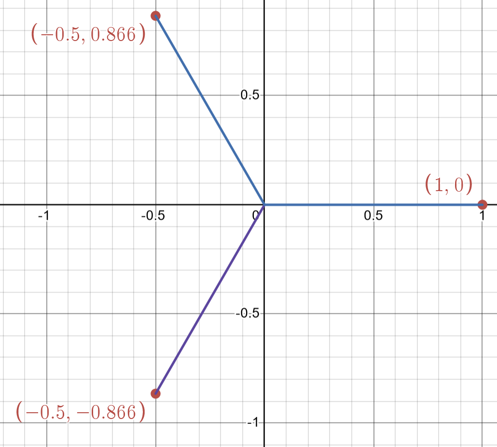
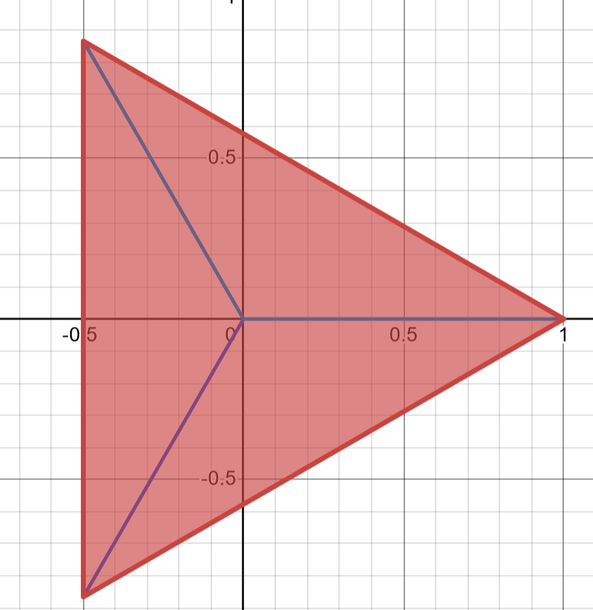

# Polygons
Drawing a polygon is an easy task, just find the angles and use your protractor and compass to draw the polygon, however not everyone has those tools readily available.
Thankfully using complex numbers we can find an elegent and simple solution to finding the x,y coordinates of any polygon

## The roots of unity

Lets say we have the equation $z^3 = 1$, an obvious solution for this is z = 1, but an n degree polynomial should have n solutions. So to get the other 2 solutions we factor out $(z-1)$ from $(z^3-1)$ we get $(z-1)(z^2+z+1) = 0$

Solving $z^2 +z +1 = 0$ we get $z = -\frac{1}{2} \pm \frac{\sqrt{3}}{2}i$, these 3 solutions are the *cube roots of unity*. If we draw these points on an Argand diagram we get the 3 points at $60\degree$ angles of one another, each of length 1.

Joining these points together we get a 3 sided polygon 

