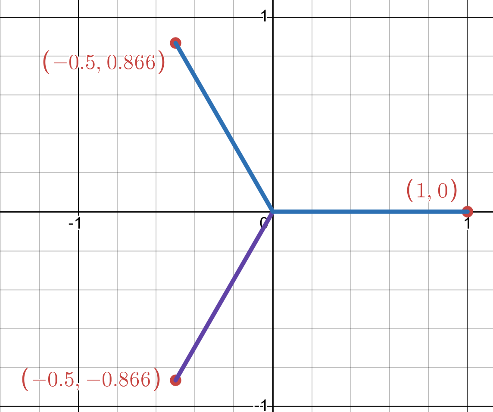
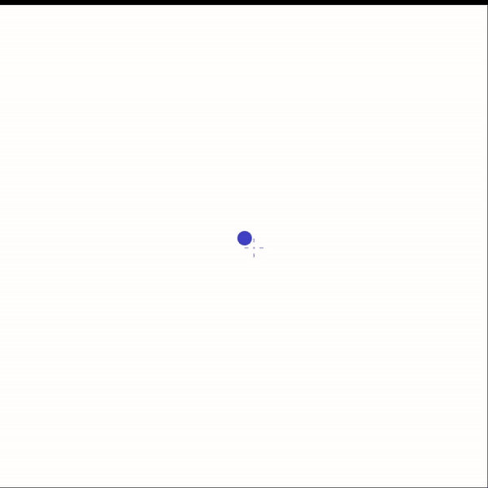

# Polygons
Drawing a polygon is an easy task, just find the angles and use your protractor and compass to draw the polygon, however not everyone has those tools readily available.
Thankfully using complex numbers we can find an elegent and simple solution to finding the x,y coordinates of any polygon

[Desmos Page](https://www.desmos.com/calculator/ipufb7wrnv)

## The roots of unity

Lets say we have the equation $z^3 = 1$, an obvious solution for this is z = 1, but an n degree polynomial should have n solutions. So to get the other 2 solutions we factor out $(z-1)$ from $(z^3-1)$ we get $(z-1)(z^2+z+1) = 0$

Solving $z^2 +z +1 = 0$ we get $z = -\frac{1}{2} \pm \frac{\sqrt{3}}{2}i$, these 3 solutions are the *cube roots of unity*. If we draw these points on an Argand diagram we get the 3 points at $60\degree$ angles of one another, each of length 1.



Joining these points together we get a 3 sided polygon 


This is the general procedure we will use to find the coordinates of any polygon. For an **n** sided polygon, find the solutions of the **nth** root of unity. Now we need to generalize the proceess of finding these solutions as easily as possible.


## Finding the **nth** root of unity

An equation $z^n = 1$ has n solutions and using 1 in polar form is $1 = \cos(0 + 2\pi k) + i \sin(0 + 2\pi k)$

Now using de Moivre's theorem, we can see than $z = \cos \left(\frac{2\pi k}{n} \right) + i \sin \left(\frac{2\pi k}{n} \right), k = \{1,2,...,n\}$

Using this formula we can easily find the coordinates of any polygon
Joining these points together we get a 3 sided polygon.

**Note**
If you draw the sum of these complex numbers as vectors by joining heads with tails, you'll get polygons of unit side length which may be the preferred way of drawing polygons on paper.


```py
from math import sin, cos, pi
```

```py

# returns a list of (x,y) coordinates for an n-sided polygon
def polygon(n : int, r : float = 1):
    t *= pi/180
    coordinates = []
    for k in range(n):
        T = 2*pi*k/n
        p = r*cos(T), r*sin(T)
        coordinates.append(p)
    return coordinates
```

What is `r` in this formula? It is not the side length of the polygon, but instead it is the radius of the circle that would fit this polygon, to get a formula for a `l` length polygon, we will need to modify our formula (an exercise for the viewer :) ).


## Rotation
We can also add a rotation to this formula. Lets say we wish to rotate by T degrees, first we have to convert to T radians.
Now $z = \cos \left(\frac{T + 2\pi k}{n} \right) + i \sin \left(\frac{T + 2\pi k}{n} \right), k = \{1,2,...,n\}$


```py
def polygon(n : int, r : float = 1, t : float = 0):
    t *= pi/180
    coordinates = []
    for k in range(n):
        T = (t + 2*pi*k)/n
        p = r*cos(T), r*sin(T)
        coordinates.append(p)
    return coordinates
```
## Stars?
By multiplying a constant `m` into $2\pi k$ we can make the polygon jump `m` points. For example lets say for n = 5, m = 2. It starts from point 0,2,4,1,3.

n = 5, m = 2 |  n = 7, m = 2 | n = 9, m = 5
:-------------------------:|:-------------------------:|:-------------------------:
  |   |  |

```py
def polygon(n : int, r : float = 1, t : float = 0, m : int = 1):
    t *= pi/180
    coordinates = []
    for k in range(n):
        T = (t + 2*m*pi*k)/n
        p = r*cos(T), r*sin(T)
        coordinates.append(p)
    return coordinates
```

## Some fun
We can play around with this in MS Paint using pyautogui

```py
import pyautogui as pag
import time

time.sleep(2)
for k in polygon(5,300):
    pag.dragRel(k)
```


```py
time.sleep(2)

x_c, y_c = pag.position()

for t in range(0,360*5, 90):
    P = polygon(5,300, t)
    for k in P:
        pag.dragRel(k)
```


```py
time.sleep(2)
r = 200
x_c, y_c = pag.position()
for r in range(0, 300, 30)[::-1]:
    P = polygon(5,r, 0, 2)
    pag.moveRel(P[0])
    for x,y in P + [P[0]]:
        k = x_c + x, y_c + y
        pag.dragTo(k)
    
    pag.moveTo(x_c, y_c)
```


```py
time.sleep(2)
r = 200
x_c, y_c = pag.position()
for t in range(0,360, 15):
    P = polygon(5,r, t)
    pag.moveRel(P[0])
    for x,y in P + [P[0]]:
        k = x_c + x, y_c + y
        pag.dragTo(k)
    
    pag.moveTo(x_c, y_c)
    r -= 10
    if (r < 0):
        break
```

